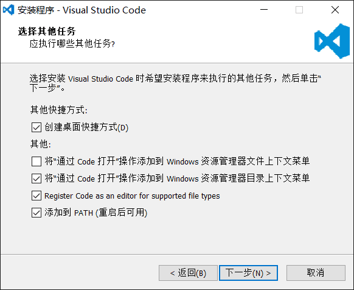

# 搭建Node开发环境

使用文本编辑器来开发Node程序，最大的缺点是效率太低，运行Node程序还需要在命令行单独敲命令。如果还需要调试程序，就更加麻烦了。

所以我们需要一个IDE集成开发环境，让我们能在一个环境里编码、运行、调试，这样就可以大大提升开发效率。

Java的集成开发环境有Eclipse，Intellij idea等，C#的集成开发环境有Visual Studio，那么问题又来了：Node.js的集成开发环境到底哪家强？

考察Node.js的集成开发环境，重点放在启动速度快，执行简单，调试方便这三点上。当然，免费使用是一个加分项。

综合考察后，我们隆重向大家推荐Node.js集成开发环境：
```
Visual Studio Code
```
Visual Studio Code由微软出品，但它不是那个大块头的Visual Studio，它是一个精简版的迷你Visual Studio，并且，Visual Studio Code可以跨！平！台！Windows、Mac和Linux通用。

# 安装Visual Studio Code

可以从Visual Studio Code的官方网站下载并安装最新的版本。

安装过程中，请务必钩上以下选项：



这将大大提升将来的操作快捷度。

在Mac系统上，Finder选中一个目录，右键菜单并没有“通过Code打开”这个操作。不过我们可以通过Automator自己添加这个操作。

先运行Automator，选择“服务”：

automator-service

然后，执行以下操作：


在右侧面板选择“服务”收到选定的“文件夹”，位于“Finder.app“，该选项是为了从Finder中接收一个文件夹；
在左侧面板选择”实用工具“，然后找到”运行Shell脚本“，把它拽到右侧面板里；
在右侧”运行Shell脚本“的面板里，选择Shell”/bin/bash“，传递输入“作为自变量”，然后修改Shell脚本如下：
```
for f in "$@"
do
    open -a "Visual Studio Code" "$f"
done
```
保存为“Open With VSCode”后，打开Finder，选中一个文件夹，点击右键，“服务”，就可以看到“Open With VSCode”菜单：


# 运行和调试JavaScript

在VS Code中，我们可以非常方便地运行JavaScript文件。

VS Code以文件夹作为工程目录（Workspace Dir），所有的JavaScript文件都存放在该目录下。此外，VS Code在工程目录下还需要一个.vscode的配置目录，里面存放里VS Code需要的配置文件。

假设我们在C:\Work\目录下创建了一个hello目录作为工程目录，并编写了一个hello.js文件，则该工程目录的结构如下：
```
hello/ <-- workspace dir
|
+- hello.js <-- JavaScript file
|
+- .vscode/  <-- VS Code config
   |
   +- launch.json <-- VS Code config file for JavaScript
```
可以用VS Code快速创建launch.json，然后修改如下：
```
{
    "version": "0.2.0",
    "configurations": [
        {
            "name": "Run hello.js",
            "type": "node",
            "request": "launch",
            "program": "${workspaceRoot}/hello.js",
            "stopOnEntry": false,
            "args": [],
            "cwd": "${workspaceRoot}",
            "preLaunchTask": null,
            "runtimeExecutable": null,
            "runtimeArgs": [
                "--nolazy"
            ],
            "env": {
                "NODE_ENV": "development"
            },
            "externalConsole": false,
            "sourceMaps": false,
            "outDir": null
        }
    ]
}
```
有了配置文件，即可使用VS Code调试JavaScript。